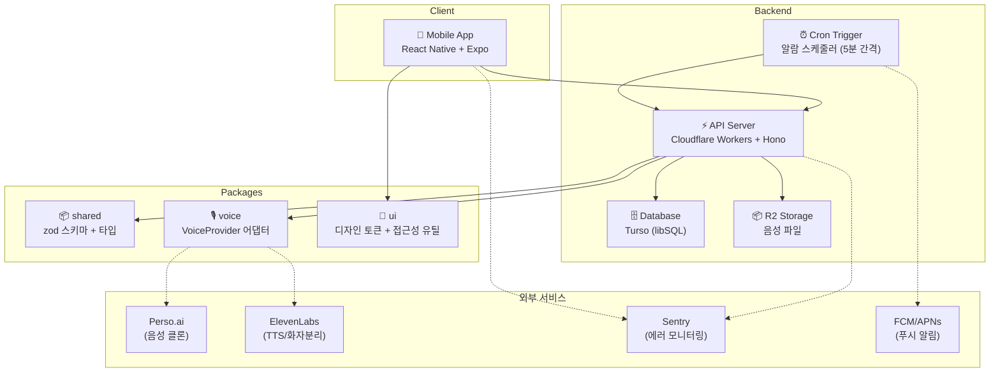

# VoiceAlarm

소중한 사람의 음성을 클론하여 알람/응원 메시지를 보내주는 앱.

통화 녹음 → 화자 분리 → 음성 클론 → TTS → 알람/푸시

## 아키텍처



## 모노레포 구조

```
voice_alarm/
├── apps/
│   └── mobile/        React Native (Expo) 앱
├── packages/
│   ├── backend/       Cloudflare Workers + Hono API
│   ├── shared/        공용 타입 + zod 스키마
│   ├── voice/         음성 어댑터 (VoiceProvider + Mock)
│   └── ui/            디자인 토큰 + 접근성 유틸
├── docs/              설계 문서 (요구사항, API, DB 스키마, 로드맵)
├── .maestro/          E2E 테스트 플로우 (Maestro)
└── store/             스토어 메타데이터 (리스팅 정보)
```

## 기술 스택

| 영역 | 기술 |
|------|------|
| 모바일 | React Native, Expo SDK 54, expo-router |
| 백엔드 | Cloudflare Workers, Hono, Turso (libSQL) |
| 스토리지 | Cloudflare R2 (음성 파일) |
| 음성 AI | Perso.ai (1차), ElevenLabs (보조) |
| 인증 | JWT 자체 발급 + 이메일/비밀번호 (bcrypt) |
| 푸시 | FCM/APNs (expo-notifications + 서버 토큰 관리) |
| 모니터링 | Sentry (모바일 @sentry/react-native + 백엔드 toucan-js) |
| 결제 | 스텁 (이용권 코드 기반) |
| 폰트 | Pretendard (한/영/일 범용) |
| 테스트 | Vitest (백엔드), Jest (모바일), Maestro (E2E) |

## 앱 구조

### 하단 탭 (4개)

| 탭 | 아이콘 | 설명 |
|----|--------|------|
| 홈 | 🏠 | 캐릭터 위젯 + 다음 알람 카운트다운 + 최근 활동 |
| 음성 | 🎙️ | 음성 프로필 관리 (최대 2개, 녹음/업로드) |
| 알람 | ⏰ | 알람 목록 + 생성/편집 (깨우기 방식 선택) |
| 메시지 | 💌 | 가족/커플 쪽지 보내기 + 받은 쪽지 |

### 헤더

- 우측 상단: **알림 벨** (수신 뱃지) + **프로필 드롭다운** (설정, 코드 등록, 다크모드, 언어, 로그아웃)

## 시작하기

### 환경변수

백엔드: `packages/backend/.dev.vars`

```
JWT_SECRET=             # JWT 서명 키
PASSWORD_PEPPER=        # 비밀번호 해싱 pepper
TURSO_DATABASE_URL=     # Turso DB URL
TURSO_AUTH_TOKEN=       # Turso 인증 토큰
PERSO_API_KEY=          # Perso.ai 음성 API (선택)
ELEVENLABS_API_KEY=     # ElevenLabs TTS API (선택)
SENTRY_DSN=             # Sentry DSN (선택)
```

모바일: `apps/mobile/.env`

```
EXPO_PUBLIC_API_URL=http://localhost:8787/api
EXPO_PUBLIC_SENTRY_DSN=  # Sentry DSN (선택)
```

### 의존성 설치

```bash
npm install
```

### 개발 서버

```bash
# 백엔드 (Wrangler dev server, localhost:8787)
npm run backend

# 모바일 앱 (Expo)
npm run app
```

### 타입 체크 / 린트 / 테스트

```bash
npm run typecheck    # 전체 workspace typecheck
npm run lint         # ESLint
npm run format:check # Prettier
npm test             # 전체 테스트 (backend + mobile)
```

## 배포

| 대상 | 배포 위치 | 트리거 |
|------|----------|--------|
| 백엔드 | Cloudflare Workers | `develop` push (CI) |
| DB | Turso `voice-alarm-devrel` | 자동 마이그레이션 |
| 앱 | EAS Build | 수동 |

### 배포 URL

- 백엔드 API: `https://voice-alarm-api.voicealarm.workers.dev`
- 모바일 앱: 미배포 (EAS Build 설정 완료)

## API 엔드포인트

모든 API는 `/api` 프리픽스. 인증 필요 엔드포인트는 `Authorization: Bearer <jwt>` 헤더 필요.

| 그룹 | 주요 엔드포인트 | 설명 |
|------|---------------|------|
| 인증 | `POST /auth/register`, `POST /auth/login`, `GET /auth/me` | 이메일/비밀번호 인증 |
| 사용자 | `GET /user/me`, `PATCH /user/plan`, `DELETE /user/me` | 프로필, 플랜, 계정 삭제 |
| 음성 | `POST /voice/clone`, `POST /voice/diarize`, `GET /voice/family` | 음성 프로필 (최대 2개) |
| TTS | `POST /tts/generate`, `GET /tts/presets` | 음성 합성, 프리셋 메시지 |
| 알람 | `GET /alarm`, `POST /alarm`, `PATCH /alarm/:id` | 알람 CRUD + 깨우기 방식 |
| 캐릭터 | `GET /characters/me`, `POST /characters/xp` | 나무 캐릭터 + 스트릭 |
| 가족 | `POST /family/invites`, `POST /family/alarms` | 가족 그룹 + 가족 알람 |
| 친구 | `POST /friend`, `PATCH /friend/:id/accept` | 이메일 기반 친구 |
| 쪽지 | `POST /notes`, `GET /notes/received` | 가족 간 텍스트 메시지 |
| 코드 | `POST /code/register` | 이용권/초대 코드 등록 |
| 라이브러리 | `GET /library`, `PATCH /library/:id/favorite` | 메시지 라이브러리 |
| 선물 | `POST /gift`, `GET /gift/received` | 음성 선물 |
| 푸시 | `POST /push/token`, `DELETE /push/token` | 푸시 토큰 관리 |
| 통계 | `GET /stats` | 사용자 활동 통계 |
| 결제 | `POST /billing/checkout`, `GET /billing/vouchers` | 구독 + 이용권 |
| 더빙 | `POST /dub`, `GET /dub/languages` | 음성 더빙 (Perso.ai) |

상세 API 문서: [`docs/R6-D_API_REFERENCE.md`](docs/R6-D_API_REFERENCE.md)

## 핵심 기능

- **음성 클론**: 오디오 업로드 → 화자 분리 → AI 음성 프로필 생성 (최대 2개)
- **TTS 메시지**: 클론된 음성으로 텍스트를 음성 메시지로 변환
- **알람**: 깨우기 방식 선택 (소리→음성 / 음성만), 반복/스누즈/진동 패턴
- **캐릭터 시스템**: 나무 테마 (🌰→🌱→🌳→🌸), 연속 기상 스트릭 🔥, 능력치
- **가족 플랜**: 초대 코드 기반 그룹, 가족 알람, 쪽지 교환
- **코드 등록**: 이용권 코드 (VA-XXXX-XXXX-XXXX) + 가족 초대 코드 (6자리)
- **오프라인 지원**: 음성/알람/메시지 로컬 캐싱, 오프라인 재생

## 테스트 현황

| 대상 | 프레임워크 | 테스트 수 |
|------|-----------|----------|
| 백엔드 | Vitest | 1379 |
| 모바일 | Jest | 1995 |
| E2E | Maestro | 13 플로우 |

## 브랜치 전략

- `main` ← `develop` ← 이슈 브랜치
- `develop`에 push → 자동 배포
- `main`은 수동 머지 (리뷰 후)

## 설계 문서

- [프로젝트 개요](docs/R6-A_PROJECT_OVERVIEW.md)
- [요구사항 정의서](docs/R6-B_REQUIREMENTS.md)
- [아키텍처](docs/R6-C_ARCHITECTURE.md)
- [API 레퍼런스](docs/R6-D_API_REFERENCE.md)
- [DB 스키마](docs/R6-E_DATABASE_SCHEMA.md)
- [로드맵](docs/R6-F_ROADMAP.md)

## 라이선스

Private
